[TOC]

# 汇编语言

# 基础知识

## 1.1数的表示

### 数制

二进制  Binary 
八进制  Octal 
十进制  Decimal 
十六进制  Hexadecimal 

### 数制之间的转换


常用数

0—00H  128—80H  255—FFH  256—100H  32767—7FFFH  65535—FFFFH

### 二进制运算

**算数运算**


**逻辑运算**

- 与
- 或
- 非
- 异或
- ……

### 计算机中数的表示

二进制

- 无符号数

  - 直接用二进制表示

- 有符号数

  

- 补码的补码就是原码

- 在计算机中，数据是以补码16进制存储在内存中的

  - 补码的运算

    - $[N1+N2]_补=[N1]_补＋[N2]_补$
    - $[N1-N2]_补=[N1]_补＋[-N2]_补$
    - ##### $[N]_{补补}= [N]$
    - 补码的加、减运算都可以转换成加法运算，运算时符号位参加运算。
    - 符号位进位丢弃，结果为负数再取补码。
    - 

  - 数的范围
    - 无符号数：8位(0--255） 16位（0--65535）
    - 有符号数：8位（-128--127） 16位（-32768--32767）
    - n位补码表示数范围：  $- 2^{n-1} <=  N <=  2^{n-1}-1​$

- 浮点数

  - （尾数）规格化+（指数）移码
  - $a = m \times be$
  - 符号位：尾数的符号，1为负，0为正；
  - 尾数：即m规格化的值；
  - 指数：即指数e的移码，即将其补码的符号位取反；
  - $(5.0)_{10}=(101.0)_2= (1.01\times 22)_2​$

### BCD码(Binary-Coded Data)

- Packed BCD：用4位二进制表示一个十进制数码
  - 0000-----0          0001-----1 
  - 0001,0010,0011,0100  = 1234
  - 
- Unpacked BCD：用8位二进制表示一个十进制数码
  - $00000000--0   00000001--1$
  - $00000001,00000010, 00000011, 00000100 = 1234$

### 字符编码

- ASCII：英文，7 bits（128个代码）
  - 数字'0'～'9'：30H～39H
  - 字母'A'～'Z'：41H～5AH
  - 字母'a'～'z'：61H～7AH
  - 空格：20H 
  - 回车CR：0DH——控制光标回到当前行的最左端
  - 换行LF：0AH——移动光标到下一行，而所在列不变
  - 空字符：0
  - 
- GB:国标码，是我国于1981年公布的国家标准，作为信息交换用汉字编码的字符(GB2312-80),包括6763个简体字以及其他字符。
- GBK: GB的扩展，包括Unicode中的20902个汉字，也称汉字大字符集
- BIG5:大五碼，包括13,060個繁體字，也是香港比較多人使用的標準。
- UNICODE:  16位二进制 = 65536  汉字：20902个
- UTF-8: 用4字节表示，232 = 42亿…

## 1.2 微型计算机（PC）系统

PC的硬件：主机、键盘、鼠标、显示器
主板的组成：CPU、存储器、外围芯片组、扩张插槽等
扩张插槽上有：RAM内存+接口卡


汇编语言程序员看到的硬件

- 中央处理单元 CPU（Intel 80x86）
  - 对汇编语言程序员，最关心其中的寄存器组
- 存储器（主存储器）
  - 呈现给汇编语言程序员的，是存储器地址
- 外部设备（接口电路）
  - 汇编语言程序员看到的是端口（I/O地址）

### CPU

- 组成：
  - 算术逻辑部件、控制部件和**寄存器组**

- CPU的作用： 
  - 控制指令的执行。
  -  执行算术与逻辑运算。
- 对汇编语言程序员来说，CPU通过寄存器完成指令的取指和执行功能
- CPU的内部总线实现CPU内部各个器件之间的联系。
- 外部总线（系统总线）实现CPU和主板上其它器件的联系

### I/O 子系统

- 通过接口电路与微机系统连接
- I/O接口电路由若干接口寄存器组成，需要用编号区别各个寄存器：数据寄存器、状态寄存器、命令寄存器
- I/O端口是I/O地址的通俗说法，是接口电路中寄存器的编号。
  - 汇编语言程序员看到的，是端口
- 8086计算机采用16位表示I/O端口，系统通过这些端口与外设进行通信
- Intel 8086支持64K个8位端口
- I/O地址可以表示为：0000H ～ FFFFH

### 内存（存储器）

内存是存放**指令**和**数据**的部件，由若干内存单元构成。

指令和数据是应用上的概念，**在内存中都是二进制数**，没有区别

- 存储器用以下单位来计量容量
  - 1个二进制位：bit（比特）
  - 8个二进制位：Byte（字节） 1Byte=8bit   $D_7～D_0$
  - 2个字节：Word（字）  1Word=2Byte=16bit  $D_{15}～D_0$
  - 1个双字：DWord = 2 Word   $D_{31}～D_0$
  - $1KB= 2_{10}=1024B$      （Kilo） 
  - $1MB=1024KB= 2^{20}$  （Mega） 
  - $1GB=1024MB= 2^{30}$   （Giga）
  - $1TB=1024GB = 2^{40}$   （Tera）
- 与内存储器相关概念：单元，地址，内容，字长
  - 把内存储器视为一个存放信息的大仓库，而一个大仓库又分成若干个小的存储间，每一个房间称为一个单元
  - 为了区别这些单元，给每个单元编号，这个编号称为地址；
  - 单元内部存放着信息称为单元的内容。
  - 单元信息的长度成为字长。
- 存储器被划分为若干个存储单元， 每个存储单元从0开始顺序编号；编号＝地址

- 数据的存储格式
  - 80x86的内存以**字节**编址：每个内存单元有唯一的地址，可存放1个字节
  - 内存单元的2个要素：地址（编号）与值（内容）。
    - 如：（100H）=34H   或者  [0002H]＝34H
    - 地址用**无符号整数**来表示（编程用十六进制表示）
  - 多字节数据在存储器中**占连续的多个存储单元**；
    - 低字节在低地址单元，高字节在高地址单元；
    - **字的地址由其低地址来表示**。双字也类似。(小端方式)
    - 同一地址可以看作是字节、字或双字单元的地址。
  - 

- 存储器芯片分类
  - 从读写属性上看分为两类：
    - 随机存储器（RAM）
    - 只读存储器（ROM）
  - 从功能和连接上分类：
    - 随机存储器RAM
    - 装有BIOS的ROM
    - 接口卡上的RAM

### 系统总线

总线是部件之间进行数据（电信号）交换的通道。


80x86计算机的系统总线分为3类：

- 地址总线
  - 地址总线用来指出数据的地址（内存或I/O）。
    - **CPU是通过地址总线来指定存储单元的**
  - 地址总线的位数决定了最大可编址的内存与I/O空间。
    - 对于N位地址总线，CPU可以提供$2^N$个不同地址：$0～2^N -1$。
    - 也就是说地址总线的宽度决定了CPU的**寻址能力**；
  - 地址总线由内存与I/O子系统共享使用（I/O只用低16位）
  - 
- 数据总线
  - 数据总线是用来**传递数据**的，定义了CPU在每个内存周期所能存取数据的**位数**。
  - 80x86系列CPU的数据总线为8位、16位、32位或64位。这就是“为什么通常的数据存取是以8位、16位、32位或64位进行的”。
  - 数据总线的宽度决定了CPU和外界的数据传送速度。数据总线越宽，处理能力越强。
  - **具有N位数据总线并不意味着CPU只能处理N位数据。**
  - 
- 控制总线
  - 控制总线用来控制CPU与内存和I/O设备之间的**数据传送方式**（如传送方向）。
  - 有多少根控制总线，就意味着CPU提供了对外部器件的**多少种控制**。
  - 控制总线的宽度决定了CPU对**外部器件**的**控制能力**。
  - 

### CPU对存储器的读写

读取数据

- 地址线寻找要读取信息地址
- 控制线发出`读`的控制指令
- 数据线在指定地址读取数据

写入数据

- 地址线寻找要写入信息地址
- 控制线发出`写`的控制指令
- 数据线在指定地址写入数据

### 内存地址空间

上述存储器在物理上是独立的器件。但以下两点相同：

1. 都和CPU的总线相连。
2. CPU对它们进行读或写的时候都通过控制线发出内存读写命令。

**CPU操作这些存储器时把它们看作一个逻辑存储器：**

- 所有的物理存储器被看作一个由若干存储单元组成的逻辑存储器；
- 每个物理存储器在这个逻辑存储器中占有一个地址段，即一段地址空间；
- CPU在这段地址空间中读写数据，实际上就是在相对应的物理存储器中读写数据。
- 最终运行程序的是CPU，我们用汇编编程的时候，必须要从CPU角度考虑问题。
  - 对CPU来讲，系统中的所有存储器中的存储单元都处于一个统一的逻辑存储器中，它的容量受CPU寻址能力的限制。
  - **这个逻辑存储器即是我们所说的内存地址空间。**
  - 一个CPU的地址线宽度为10，那么可以寻址1024个内存单元，这1024个可寻到的内存单元就构成这个CPU的内存地址空间。

不同计算机系统的内存地址空间分配情况是不同的


## 1.3 Intel 80x86系列微处理器


- 16位80x86处理器
  - 8086/8088指令系统提供16位基本指令集
  - 80186/80188增加若干条实用指令 
  - 8086的工作方式是**实方式**（Real Mode）
  - 80286增加保护方式（Protected Mode）
  - 80286引入了系统指令
    - 为操作系统等核心程序提供处理器控制功能

- IA-32处理器（Intel Architecture-32）
  - 80386引入英特尔32位指令集结构ISA
    - 兼容原16位80286指令系统
    - 全面升级为32位
    - 提供虚拟8086工作方式（Virtual 8086 Mode）
  - 80486集成浮点处理单元支持浮点指令
  - Pentium系列
    - 陆续增加若干整数指令、完善浮点指令
    - 增加一系列多媒体指令（SIMD指令）
- Intel 64处理器
  - 引入64位英特尔指令集结构
    - 兼容32位指令系统
    - 新增64位工作方式
  - 继续丰富多媒体指令
  - 处理器集成多核（Multi-core）技术

## 1.4 8086微处理器

### 1.4.1 内部结构

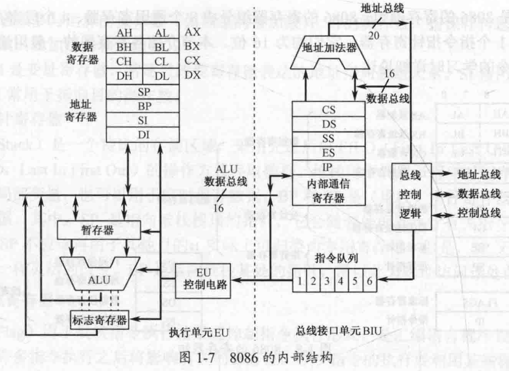

- 组成：
  - 算术逻辑部件、控制部件和**寄存器组**
- CPU的作用：
  - 执行算术与逻辑运算
  - 控制指令的执行

这些器件靠内部总线相连。内部总线实现CPU内部各个器件之间的联系。

外部总线（系统总线）实现CPU和主板上其它器件的联系。

- 执行单元EU
  - **左半部分**为执行单元（EU），由算数逻辑单元（ALU）、数据寄存器、地址寄存器、标志寄存器和指令译码的EU控制逻辑等构成
  - 负责指令的译码、执行和数据的运算
- 总线接口单元BIU
  - **右半部分**为总线接口单元（BIU），由6字节的指令队列、指令指针（IP）、段寄存器（CS，DS，SS，ES）、地址加法器和总线控制逻辑等构成。
  - 管理8086与外部总线的接口，负责CPU对存储器和外设进行访问。
  - 8086所连接的总线由16位的双向数据线、20位地址线和若干控制线组成。
- 对汇编语言程序员来说，CPU通过**寄存器**完成指令的**取指（取指令）**和**执行**功能。 
  - 取指是从主存储器中取出指令代码进入CPU。
  - 执行是将指令代码翻译成它代表的功能（被称为译码），并发出有关控制信号实现这个功能。

### 1.4.2 存储器组织

#### 1. 数据的存储格式

基本单位为一个二进制位：bit

8个bit组成一个字节：Byte，位编号从右向左从0开始递增：$D_7 \sim D_0$

其中最低为称为最低有效位（LSB），最高位称为最高有效位（MSB）

存储器以字节位单位存储信息，为了正确存储，每个存储单元被赋予一个地址。地址编号从0开始，顺序加1，是一个无符号十六进制数。

存储单元中存放的信息为该存储单元的内容。如0002H地址的存储器中存放的信息为34H，即二单元的内容为34H，表示为 $\lbrack 0002H\rbrack =34H$

那么如何存放一个字或双字呢？

字或双字在存储器中占据2或4个存储单元：存放时，低字节存入低地址，高字节存入高地址

#### 2. 存储器的分段管理

16位结构描述了一个CPU具有以下特征：

1. 运算器一次最多可以处理16位的数据。
2. 寄存器的最大宽度为16位。
3. 寄存器和运算器之间的通路是16位的。

8086有20位地址总线，可传送20位地址，寻址能力为1MB = $2^{20}B$，地址范围为00000H~FFFFFH

整个1MB主存空间从地位地址到高位地址可分为四个区段：（实方式主存）

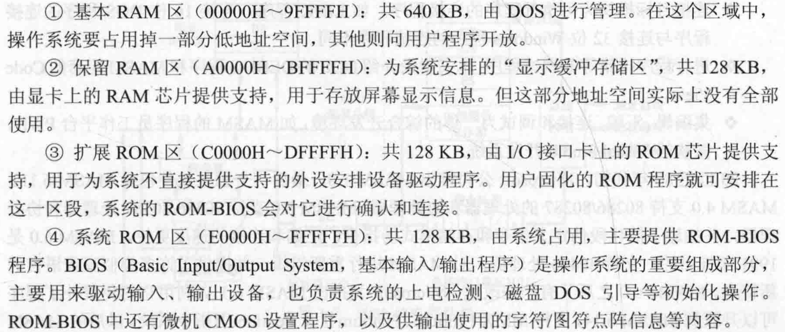

8086内部为16位结构，它只能传送16位的地址，表现出的寻址能力却只有64K

#### 如何给出20位的物理地址: 分段技术

- 地址加法器合成物理地址的方法：用两个16位地址合成一个20位的物理地址。


默认200后面还有一个0 $\to​$ 段地址×16

将存储器分成若干个逻辑段段首地址必须为：$****0H​$。

其有效地址“$****H$”存放在**段寄存器**中，称为**段地址**。

段中某一个单元相对于段首的距离称为**偏移地址**，偏移地址存放在**偏移地址寄存器**中。

段的长度不超过$2^{16}=64K$。


8086CPU给出物理地址的方法:

- ALU完成加法，地址加法器

- 段地址一般在程序开始时预定
- 访问某一个内存单元，程序中只需要给出16位偏移地址


**分段技术小结**

- 内存并没有分段，段的划分来自于CPU，由于8086CPU用`（段地址×16）+ 偏移地址 = 物理地址`的方式给出内存单元的物理地址，使得我们可以用分段的方式来管理内存
- 段地址×16 必然是16的倍数，所以一个段的起始地址也一定是16的倍数；可根据需要，将**地址连续、起始地址为16的倍数的一组内存单元定义为一个段。**
- 偏移地址为16位，16 位地址的寻址能力为 64K，所以一个段的长度最大为64K。也就是说**给定一个段地址**，仅通过变化偏移地址来进行寻址，**最多可以定位64K个内存单元**。 0~FFFFH
- CPU访问内存单元时，必须向内存提供内存单元的最终物理地址=段地址+偏移地址
- CPU可以用不同的段地址和偏移地址形成同一个物理地址，如下例
- 

### 1.4.3 寄存器组

对汇编语言程序员来说，关心的是**CPU的寄存器**

- 8086／8088中共有14个16位寄存器 
- 寄存器在CPU内部，所以访问速度快。但容量小

可编程寄存器可分为：

- 通用寄存器
  - 在处理器中数量较多，使用频率较高，具有多种用途
  - 比如可用来进行存放指令需要的操作数据
- 专用寄存器
  - 只用于特定目的
- 8086分为**8个通用寄存器，4个段寄存器，1个标志寄存器和1个指令指针寄存器，均为16位**

#### 寄存器与存储器的比较

- 寄存器
  - 在CPU内部
  - 访问速度快
  - 容量小，成本高
  - 用名字表示
  - 没有地址
- 存储器
  - 在CPU外部
  - 访问速度慢
  - 容量大，成本低
  - 用地址表示
  - 地址可用各种方式形成

#### 总览

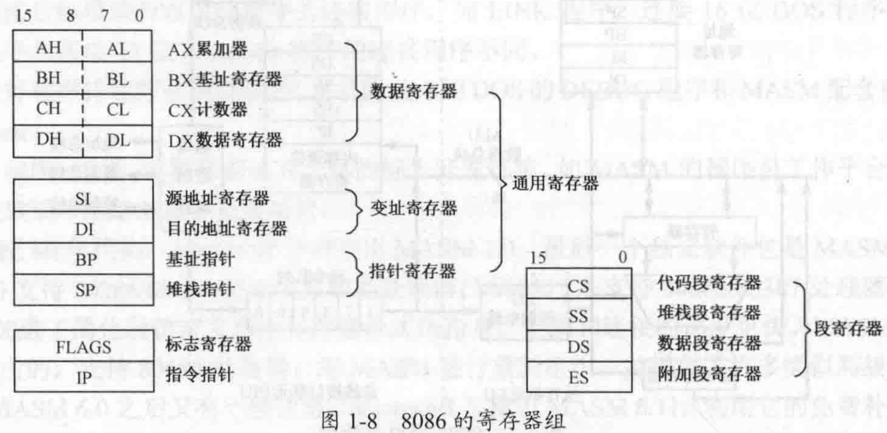

#### 1. 通用寄存器

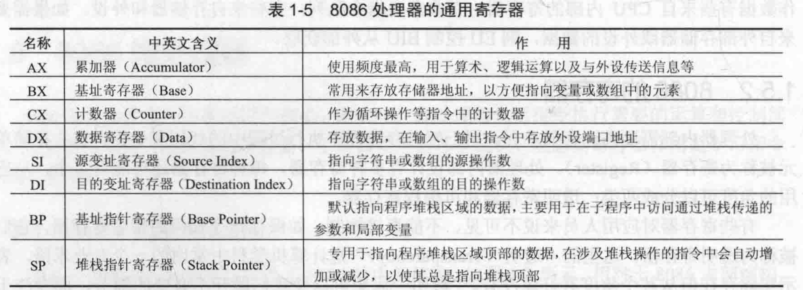

##### 数据寄存器：AX/BX/CX/DX

存放**任何数据信息**。暂存计算的中间结果，数据中转站。

每个寄存器又有它们各自的专用目的：

- AX (Accumulator)——累加器，使用频度最高，用于算术、逻辑运算以及与外设传送信息等；
- BX (Base)——基址寄存器，常用做存放存储器**地址**；
- CX (Count)——计数器，作为循环和串操作等指令中的隐含计数器；
- DX (Data)——数据寄存器，常用来**存放双字长数据的高16位，或存放外设端口地址。**

他们还可以进一步的分为高字节H(high)和低字节L(Low)；两部分，这样就有了8个8位通用寄存器，操作互不影响，也可一起使用。

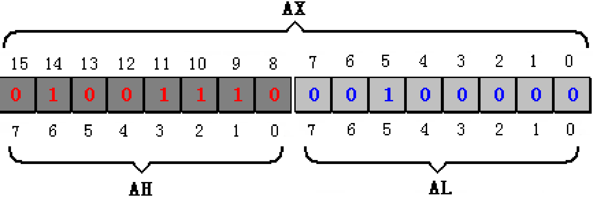

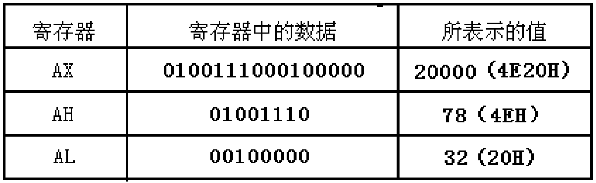

##### 变址寄存器:SI/DI

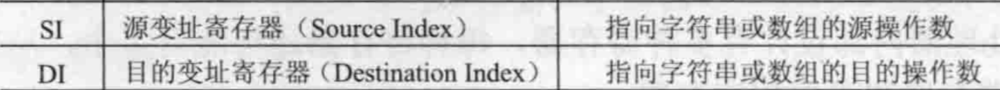

变址寄存器常用于存储器寻址时提供**地址**，有两个是因为很多运算是余姚两个操作数才能进行的（加法等）

16位，不可拆分使用

#### 2. 段寄存器:CS/DS/SS/ES

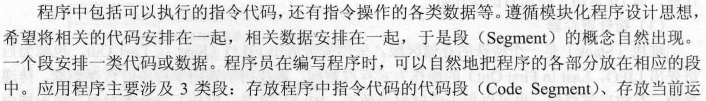

- 段寄存器用来确定该段在内存中的起始地址

- 用途特定，不可分开使用

4个**专门存放段地址**的段寄存器（16位）

- 代码段  段寄存器 CS
- 数据段  段寄存器 DS
- 堆栈段  段寄存器 SS
- 附加段  段寄存器 ES

 **物理地址= 10H × (DS) + 偏移**

（最大偏移地址为FFFFH）

得到的地址必须是16的倍数

```
解释为什么必须是16的倍数
这是历史遗留问题.
　　intel 8088时代，计算机的地址总线是20位的,即可以寻址能力可以达到1M字节,但是它的ALU和寄存器都只有16位,也就是表示数的能力只能达64k，再大就逾锅了。那怎么办呢？INTEL想了一个办法，让两个寄存器对来表示一个物理地址，比如说DS：BX，前者叫段寄存器，后者叫偏址寄存器。由于这两个寄存器都是16位，直接相加还是不能匹配20位的地址线的访问能力，因此，INTEL公司变通了一下，人为地将这个组合寻址设计成：在它们组合时，让段寄存器左移四位（假设DS是1234H，左移4位就变成了12340H，至于它内部怎么实现我们不用管它。注意，对于16进制的数来说，乘以16就相当于在原数后面补个0，因为它是逢16进1啊；与10进制数乘10就是后面补0同样道理。）然后与偏址寄存器相加，这样得到的地址最大可以到0FFFFFH。这样行了。
　　现在都32位机了，甚至64位了，所以上面的寻址方法在保护模式下不再用了。
```

例：(DS)=3000H,  偏移=1234H,  物理地址= 10H × (DS) + 偏移 =31234H


CPU几种典型的操作

- 取 指 令：  指令单元地址＝（CS）×10H＋IP(用于存指令的寄存器的偏移地址)
- 堆栈操作：堆栈数据地址＝（SS）×10H＋偏移（代码中指出即可，下同）
- 内存数据：内存数据地址＝（DS）×10H＋偏移

##### CS+IP (Instruction Pointer)

**CS+IP**是8086CPU中最关键的寄存器，它们指示了**CPU当前要读取指令的地址**。

指令指针寄存器IP，指示代码段中指令的**偏移地址**

它与代码段寄存器CS联用，确定下一条指令的**物理地址**

IP寄存器是一个专用寄存器,程序一般不可直接使用

##### SS+指针寄存器:SP/BP

- SP和BP寄存器与SS段寄存器联合使用以确定**堆栈段中的存储单元地址**
- 指针寄存器用于**寻址**内存堆栈内的数据
  - SP (Stack Pointer)为堆栈指针寄存器，指示栈顶的**偏移地址**
  - SP 不能再用于其他目的，具有专用目的
  - BP (Base Pointer)为基址指针寄存器，表示数据在堆栈段中的**基地址**

##### 堆栈（Stack）

堆栈是主存中一个特殊的区域

它采用**先进后出**FILO（First In Last Out）或后进先出LIFO（Last In First Out）的原则进行存取操作，而不是随机存取操作方式

堆栈通常由处理器自动维持

在8086中，由堆栈段寄存器**SS**和堆栈指针寄存器**SP**共同指示


##### 数据段（Data Segment）

- 数据段存放运行程序所用的数据
  - 数据段寄存器**DS**存放数据段的段地址
  - 各种主存寻址方式（有效地址EA）得到存储器中操作数的偏移地址
- CPU利用**DS:偏移地址**存取数据段中的数据

##### 附加段（Extra Segment）

- 附加段是附加的数据段，也用于数据的保存：
  - 附加段寄存器ES存放附加段的段地址
  - 各种主存寻址方式（有效地址EA）得到存储器中操作数的偏移地址
- 处理器利用**ES:偏移地址**存取附加段中的数据
- 串操作指令将附加段ES作为其目的操作数的存放区域

##### 如何分配各个逻辑段

- 程序的指令序列必须安排在代码段CS
- 程序使用的堆栈一定在堆栈段SS
- 程序中的数据默认是安排在数据段DS，也经常安排在附加段ES，尤其是串操作的目的区必须是附加段ES
- 数据的存放比较灵活，实际上可以存放在任何一种逻辑段中

##### 段寄存器的使用规定

| 访问存储器的方式   | 默认 | 可超越   | 偏移地址    |
| ------------------ | ---- | -------- | ----------- |
| 取指令             | CS   | 无       | IP          |
| 堆栈操作           | SS   | 无       | SP          |
| 一般数据访问       | DS   | CS ES SS | 有效地址\EA |
| BP\基址的寻址方式  | SS   | CS ES DS | 有效地址\EA |
| 串操作的源操作数   | DS   | CS ES SS | SI          |
| 串操作的目的操作数 | ES   | 无       | DI          |


#### 3. 标志寄存器

标志寄存器F(FLAGS),又称**程序状态字寄存器**PSW

FLAGS中的各种标志分成了两类：6个状态标志和3个控制标志

- 状态标志位：CF,OF,ZF,SF,PF,AF
  - 由CPU根据当前程序运行结果的状态自动完成的
  - 一般用作转移指令的转移控制条件
- 控制标志位DF,IF,TF
  - 用以存放控制CPU工作方式的标志信息
  - 由程序设置

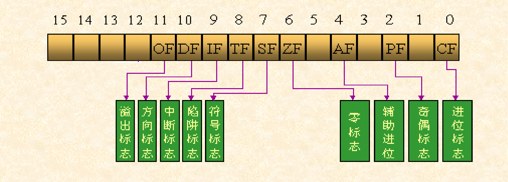

##### 1. 状态标志位

###### 进位标志CF（Carry Flag）

进行**无符号数运算**的时候，当运算结果的最高有效位有进位（加法）或借位（减法）时，进位标志置1，即CF = 1；否则CF = 0。

```
例如：
  3AH + 7CH＝B6H
  没有进位：CF = 0
  
  AAH + 7CH＝（1）26H
  有进位：CF = 1
```

###### 零标志ZF（Zero Flag）

若运算结果为0，则ZF = 1，否则ZF = 0

```
例如：
    3AH + 7CH＝B6H，结果不是零：
    ZF = 0
    
    86H + 7AH＝（1）00H，结果是零(为什么？)：
    ZF = 1
注意：ZF为1表示的结果是0
```

###### 符号标志SF（Sign Flag）

CPU对有符号数运算结果的一种记录，记录数据的正负

- 结果为负，SF = 1；
- 结果为正，SF = 0。

```
例如：
  mov al,10000001B 
  add al,1
  
  执行后，结果为10000010B，SF=1，
  表示：如果指令进行的是有符号数运算，那么结果为负；
```

注意：

- 在我们将数据当作有符号数来运算的时候，可以通过它来得知结果的正负。
- 如果我们将数据当作无符号数来运算，SF的值则没有意义，虽然相关的指令影响了它的值。

###### 奇偶标志PF （Parity Flag）

当运算结果最低字节中“1”的个数为偶数时，PF = 1；否则PF = 0。

```
例如：
    3AH + 7CH＝B6H＝10110110B，

结果中有5个1，是奇数：PF = 0
注意：PF标志仅反映最低8位中“1”的个数是偶或奇，即使是进行16位字操作。
```

###### 辅助进位标志AF （Auxiliary Carry Flag）

运算时D3位（低半字节）有进位或借位时，  AF = 1；否则AF = 0。

```
例如：
   3AH + 7CH＝B6H
   D3有进位：AF = 1
```

这个标志主要由处理器内部使用，用于十进制算术运算指令中，用户一般不必关心。（**类似于进位标志**）

###### 溢出标志OF（Overflow Flag）

有符号数运算的结果有溢出，则OF=1；否则 OF＝0。
只是对有符号数而言。对无符号数而言，OF＝1并不意味着结果出错。

```
例如：
    mov al,98
    add al,99
    
执行后将产生溢出。
因为add al,99 进行的有符号数运算是：(al)=(al)+99=98+99=197
而结果197超出了机器所能表示的8位有符号数的范围：
-128~127。
```

**什么是溢出**

- 处理器内部以补码表示有符号数
  - 8个二进制位能够表达的整数范围是：+127 ~ -128
  - 16位表达的范围是：+32767 ~ -32768
- 如果运算结果超出这个范围，就是产生了溢出
- 有溢出，说明有符号数的运算结果不正确
- 无符号数有溢出吗？
  - FFH + 01H = 00H, CF = 1, 进位

**溢出和进位**

- 溢出标志OF和进位标志CF是两个意义不同的标志
- 进位标志CF表示无符号数运算结果是否超出范围，运算结果仍然正确；
  - 可恢复的错误。
- 溢出标志OF表示有符号数运算结果是否超出范围，运算结果已经不正确。
  - 不可恢复错误。

**溢出和进位的对比**

```
例1：7FH + 01H＝80H
无符号数运算：127＋1＝128，  范围内，无进位
有符号数运算： 127＋1＝128 ，范围外，有溢出

例2：FFH + 01H＝（1）00H
无符号数运算：255＋1＝256，范围外，有进位
有符号数运算：－1＋1＝0 ，   范围内，无溢出
```

**如何运用溢出和进位**

- 处理器对两个操作数进行运算时，并不知道操作数是有符号数还是无符号数，所以全部设置，按各自规则。
  应该利用哪个标志，则由程序员来决定。
- 将参加运算的操作数是无符号数，就注意CF；
- 将参加运算的操作数是有符号数，则注意OF。

```
例： MOV  AX, 1
    MOV  BX, 2
    ADD  AX, BX
    指令执行后，(AX)=3, OF=0, CF=0, ZF=0, SF=0

例： MOV  AX, FFFFH
    MOV  BX, 1
    ADD  AX, BX
    指令执行后，(AX)=0, OF=0, CF=1, ZF=1, SF=0
```

##### 2. 控制标志

###### 方向标志DF（Direction Flag）

- 用于串操作指令中，控制地址的变化方向：
  - 设置DF＝0，串操作的存储器地址自动增加；
  - 设置DF＝1，串操作的存储器地址自动减少。

###### 中断允许标志IF（Interrupt-enable Flag）

- 用于控制外部可屏蔽中断是否可以被处理器响应：
  - 设置IF＝1，则允许中断；
  - 设置IF＝0，则禁止中断。

###### 陷阱标志TF（Trap Flag）

- 用于控制处理器是否进入单步操作方式：
  - 设置TF＝0，处理器正常工作；
  - 设置TF＝1，处理器单步执行指令。
- ==单步执行指令——处理器在**每条指令执行结束**时，便产生一个编号为1的内部中断。==这种内部中断称为单步中断，所以TF也称为单步标志。
  - 利用单步中断可对程序进行逐条指令的调试。
  - 这种逐条指令调试程序的方法就是单步调试。

#### 4. 指针指令寄存器（IP）

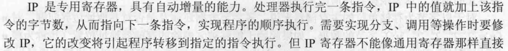

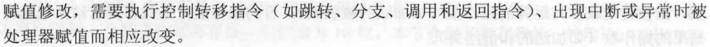

## 1.5 8086的寻址方式


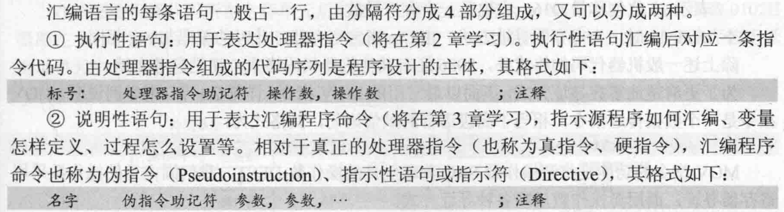

有些指令不需要操作数，通常的指令都有一个或两个操作数，个别指令有3个甚至4个操作数

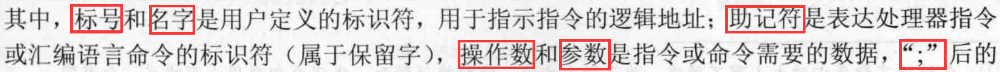

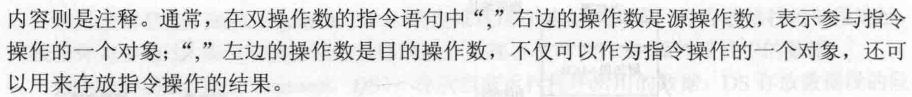

标准机器代码示例

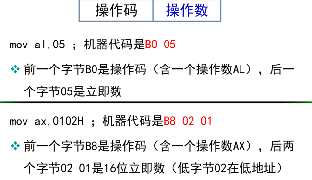


### 1.5.1 8086机器码格式

机器码格式：将指令以2进制数0和1进行编码的形式，也被称为**指令编码格式**

8086机器代码格式如图所示：

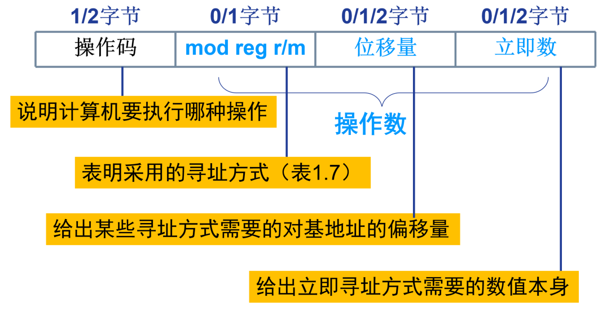

操作码占1至两个字节

设计有多种寻址方式，因此操作数的个字段有多种组合：

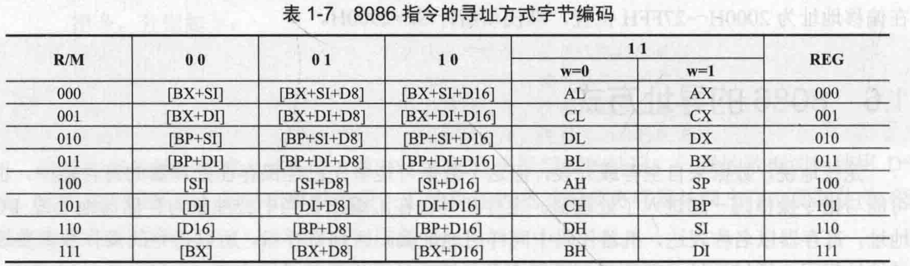


### 1.5.2 指令格式

- 每种指令的**操作码**：
  - 用一个唯一的助记符表示（指令功能的英文缩写）
  - 对应着机器指令的一个二进制编码
- 指令中的**操作数**：
  - 立即操作数：一个具体的数值
  - 寄存器操作数：存放数据的寄存器
  - 内存操作数：指明数据在主存位置的存储器地址
    -   通常为有效地址EA，段地址在某个段寄存器中

### 1.5.3 寻址方式

#### 1. 立即寻址方式

操作数在指令中给出,作为指令机器码的一部分存储

​     MOV  AL, 34H         ；机器码：B0 34

​     MOV  AX, 0034H     ；机器码：B8 34 00

使用场合：常数，8位和16位。 

立即数寻址方式常用来给寄存器赋值

​	MOV AL,05H		；AL←[05H]

​	MOV AX,0102H		；AX←[0102H]

​	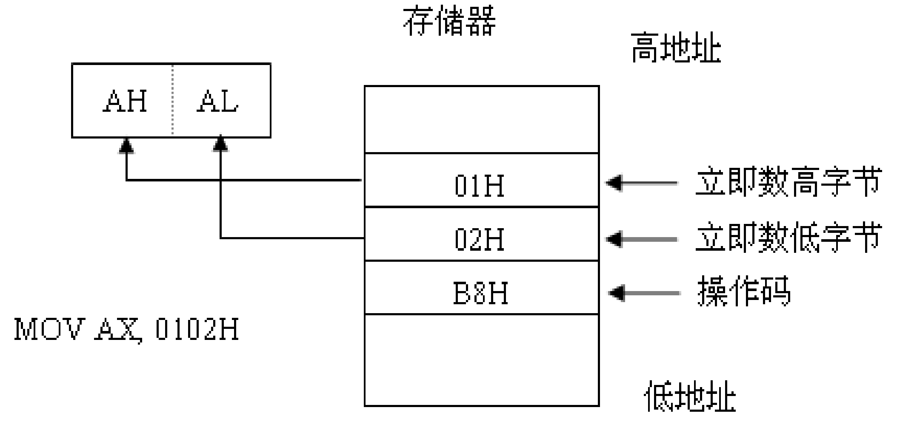


#### 2. 寄存器寻址方式

- 操作数在指定的数据寄存器中
  - MOV  AX, BX
  - MOV  AL, BH
- 注意可用寄存器：
  - 8位寄存器r8：AH、AL、BH、BL、CH、CL、DH、DL
  - 16位寄存器r16：AX、BX、CX、DX、SI、DI、BP、SP
  - 4个段寄存器seg：CS、DS、SS、ES
  - **CS/IP不能用作目的操作数：**
    - **MOV  CS/IP, AX （X）**

#### 3. 内存操作数寻址方式

指令中给出操作数的主存地址信息（偏移地址，称之为有效地址EA），而段地址在默认的或用**段超越**前缀指定的段寄存器中

**段超越**

隐式段地址——8086/8088指令系统对存储单元的访问，其段地址都是从系统事先约定好的段寄存器中获取； 

**规则为：除串操作指令外，若出现BP（SP），默认在SS中，否则所有的操作都默认在DS中。**

（显式段地址）**段超越**不是按照系统的约定，而是在指令中显式指定某一段寄存器作为存储器操作数的段地址

寻址方式分类：

- 直接寻址方式(direct addressing)
  - 内存操作数的偏移地址由指令直接给出
  - 例如：`MOV  AX, [2000H]  ；AX←DS:[2000H]`
  - 注意：
    - 隐含的段为数据段 DS
    - 物理地址 = 16 * (DS) +偏移地址
- 寄存器间接寻址方式(register indirect)
  - 指定某个地址寄存器（SI、DI、BX、BP）的内容作为内存操作数的偏移地址
  - 使用场合：表格、字符串、缓冲区处理
  - `MOV AX, [BX]    ；AX←DS:[BX]`
  - 注意段地址规则：
    - BX, SI, DI $\to$ (DS)                                          
    - BP $\to​$ (SS)
- 寄存器相对寻址方式(register relative)
  - 指令中指定地址寄存器（SI、DI、BX、BP）与一个位移量相加作为内存操作数的偏移地址
  - 使用场合：适于表格、字符串、缓冲区的处理；
  - `MOV AX,[SI+2]       ；AX←DS:[SI+02H]`
  - `MOV AX,[BP+06H]     ；AX←SS:[BP+06H]`
  - 
- 基址变址寻址方式(based indexed..)
  - 指定基址寄存器(BX,BP)、变址寄存器(SI,DI)内容相加作为内存操作数的地址。
  - 使用场合：适于数组、字符串、表格的处理，更加灵活
  - `MOV [BX+DI],DX`      
  - `MOV AL, [BP+SI]  ；AL←SS:[BP+SI]`
  - 注意：必须是一个基址寄存器和一个变址寄存器的**组合**
- 相对基址变址方式(relative based indexed..)
  - 指定基址寄存器(BX,BP) 、变址寄存器(SI,DI) 、位移量之和作为内存操作数的地址
  -  使用场合：适于二维数组的寻址`Buffer[BX][SI] = [Buffer+BX+SI]`
  - `MOV AL, [SI+BX+2]    MOV [BX+DI-16H], DX   MOV AL, 2[SI+BX]   ；AL←DS:[BX+SI+02H]`


寻址方式的多种表示方式

- 位移量可用符号表示：

     MOV AX,[SI+**COUNT**]  	 ；COUNT是事先定义的变量或常量（就是数值）

     MOV AX,[BX+SI+**WNUM**]     ；WNUM是变量或常量

- 同一寻址方式可以写成不同的形式：

     MOV AX,[BX][SI]          ；MOV AX,[BX+SI]

     MOV AX,COUNT[SI]         ；MOV AX,[SI+COUNT]

     MOV AX,WNUM[BX] [SI]           

  ；等同于  MOV AX,WNUM[BX+SI]

  ；等同于  MOV AX,[BX+SI+WNUM]

